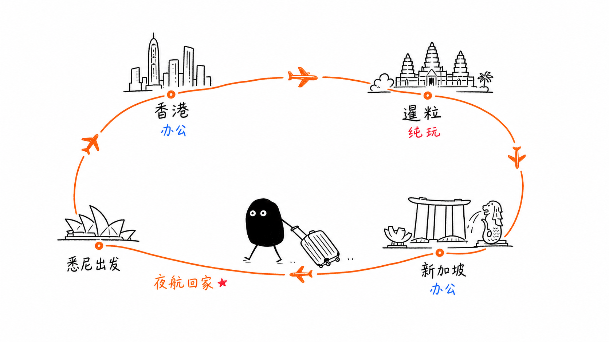
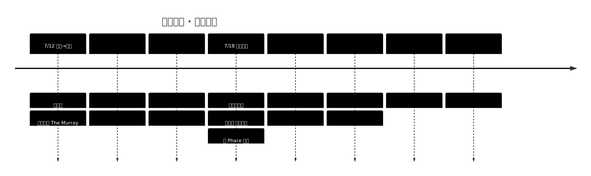
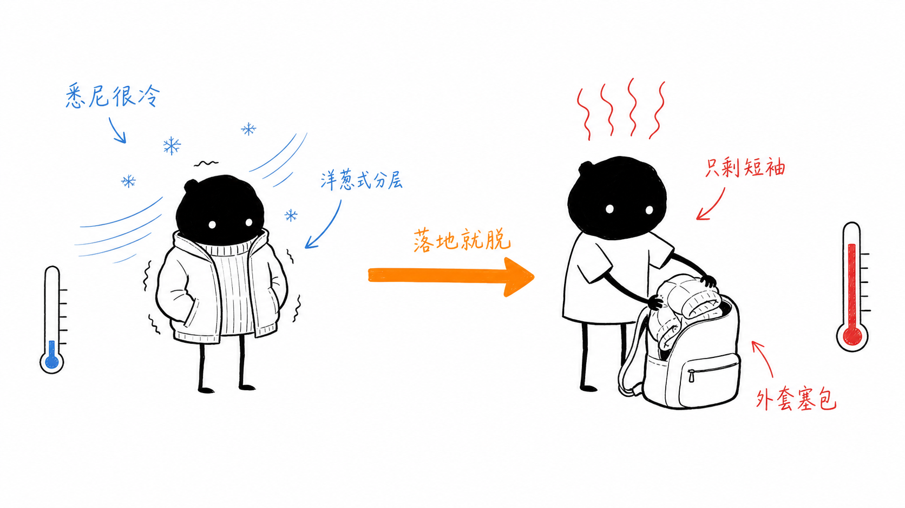

# 🧳 悉尼 × 香港 × 暹粒 × 新加坡 · 半月行程

> 7/12–7/26，悉尼出发的一趟「工作 + 玩」环线：香港办公 5 天 → 暹粒吴哥 2 天纯玩 → 新加坡办公 5 天 → 夜航回悉尼。单人出行。
>
> _本页由行程主清单整理生成，已做公开脱敏（隐去证件号、订座号、私人电话等）。_

## Basics

| | |
|---|---|
| **日期** | 2026-07-12 → 2026-07-26（15 天） |
| **出发 / 返程** | 悉尼 Sydney（冬天，白天约 17°、夜 8–11°） |
| **途经** | 香港 🇭🇰 → 暹粒 🇰🇭 → 新加坡 🇸🇬（全程 26–33° 湿热） |
| **同行** | 单人 |
| **暹粒预算** | 约 USD 315（2 天纯玩自费部分） |
| **主力支付** | Wise 卡取现/直扣、Amex 白金卡日常、Visa 备用；暹粒带足小面额美元 |

## 行程时间线

| 日期 | 星期 | 安排 | 住宿 |
|---|---|---|---|
| **7/12** | 周日 | 悉尼 ✈️ 香港，傍晚到 | 香港酒店 |
| 7/13–7/17 | 周一–五 | 香港办公 🏢 | 香港酒店 |
| **7/17** | 周五下午 | 香港 ✈️ 暹粒（傍晚到） | 暹粒酒店（第 1 晚） |
| **7/18** | 周六 | 吴哥暴走一整天 🌅 | 暹粒酒店（第 2 晚） |
| **7/19** | 周日 | 上午博物馆+老市场，下午 ✈️ 新加坡 | 新加坡酒店 |
| 7/20–7/24 | 周一–五 | 新加坡办公 🏢 | 新加坡酒店 |
| **7/25** | 周六晚 | 新加坡 ✈️ 悉尼（夜航） | — |
| **7/26** | 周日早 | 抵达悉尼 🏠 | 到家 |

## Preferences & 节奏

- **工作为主、玩为辅**：香港/新加坡各 5 个工作日，办公室是 smart casual（T 恤 + 薄夹克 + 干净板鞋即可，不需西装领带）。
- **暹粒是唯一纯玩窗口**：只有 7/18 一整天 + 7/19 上午，动线要「先看实景庙、再看文物」，不贪多。
- **冷暖矛盾集中在头尾两天**：悉尼冬天 ⇄ 三地湿热，靠一件能压扁塞包的薄外套做「洋葱式分层」，首尾各用一次。
- **膝盖注意**（左髌骨轻伤）：吴哥暴走日穿有后带的运动凉鞋 + 香港买的髌骨绑带。
- **饮食**：暹粒必尝 Amok 咖喱鱼、Lok Lak；随缘不预订。

## 交通（机票 · 已订）

| 段 | 日期 | 航线 | 航班 | 舱位 |
|---|---|---|---|---|
| ① 去程 | 7/12 | 悉尼 SYD 10:10 → 香港 HKG 17:45 | 国泰 CX162 直飞 | 商务 |
| ② | 7/17 | 香港 HKG 13:20 → 暹粒 SAI 18:55 | 曼谷航空（1 经停） | 经济 |
| ③ | 7/19 | 暹粒 SAI 16:00 → 新加坡 SIN 19:25 | 新航 SQ165 直飞 | 经济 |
| ④ 返程 | 7/25 | 新加坡 SIN 20:20 → 悉尼 SYD | 英航 BA0015 夜航 | 商务 |

- 市内交通：新加坡 & 暹粒用 Grab（暹粒也可 PassApp），香港用八达通 / 机场快线直达中环。
- 🛋️ **贵宾室**：持 Amex 白金卡（Centurion + Priority Pass + Plaza Premium）；首尾商务舱可进寰宇一家 lounge。悉尼首选 Qantas Business，香港刷白金进 Centurion，新加坡返程首选樟宜 T1 的 Qatar Premium Lounge（起飞前约 3h 值机柜台才开，18:00 后进 lounge 吃好再登机）。

## 住宿（均已订）

| 城市 | 酒店 | 日期 | 到公司通勤 |
|---|---|---|---|
| 🇭🇰 香港 | The Murray, Niccolo（中环 Cotton Tree Drive） | 7/12–7/17（5 晚） | 到中环 QRT 办公室走路 5–8 分钟 |
| 🇰🇭 暹粒 | HARI Residence & Spa（Svaydangkum） | 7/17–7/19（2 晚） | 入住 14:00 / 退房 12:00，店内带 Spa |
| 🇸🇬 新加坡 | The Fullerton Hotel（1 Fullerton Square） | 7/19–7/25（6 晚） | 过河到 Marina Bay CBD 办公室走路 10–12 分钟 |

> 三家都是高档酒店，浴室挂钩 + 衣架充足 → 速干衣全程自己手洗，不靠送洗，箱子更轻。

## 暹粒纯玩重点

### 🌅 7/18 吴哥一日游（经典小圈 Small Circuit）

| 时间 | 安排 |
|---|---|
| 04:30 | 酒店出发（突突车/Grab 一日包车 ~USD 20–25） |
| 05:00–06:30 | **吴哥窟 Angkor Wat 看日出**（倒影池前占位） |
| 06:30–08:00 | 趁人少进主殿，再回点吃早餐 |
| 08:30–10:30 | **大吴哥 Angkor Thom + 巴戎寺 Bayon**（高棉的微笑） |
| 10:30–12:00 | **塔布茏寺 Ta Prohm**（古墓丽影取景，树根盘墙） |
| 12:00–14:00 | 回城午餐 + 避暑午休（正午最晒） |
| 15:00–17:30 | 巴肯山看日落 / 或女王宫 Banteay Srei |
| 20:00 | **Phare 柬埔寨马戏团**（1 小时，杂技+话剧+现场乐队，世界级口碑） |

- 🎫 门票：吴哥 **1 日票 USD 37**（官网 angkorenterprise.gov.kh，唯一官方）。只有这一整天能逛，3 日票用不上。
- 👕 着装：寺庙主殿强制 **过膝长裤 + 有袖上衣**，否则被拦；带水、防晒、驱蚊。

### 🌙 两晚夜玩

- **周五 7/17（落地放松）**：20:30 突突去 Pub Street 吃热乎高棉菜（Amok），22:00 街边正规店脚底+全身按摩 $6–10/h，早睡（明早看日出）。
- **周六 7/18（暴走后犒劳，重头戏）**：18:30 去 Phare 马戏（B 区 $28 性价比最高）→ 21:15 Pub Street 喝一杯（Angkor 啤酒 $0.5 起）→ 22:30 Bodia Spa 高档按摩 $25–40 收尾。

### 🕐 7/19 上午（退房前～赶机，体力回血版）

睡到自然醒 + 好早餐 → 🏛️ **吴哥国家博物馆**（08:30 开门，市区吹空调，门票 ~USD 12，1.5–2h，建议租中文音频导览）→ **老市场 Old Market 买手信** → 13:30 前赶机场。跟 7/18 的司机约「博物馆→老市场→机场」一条龙约 $10–15。

### 🍜 吃 & 读

- 精致高棉菜：Kroya by Chef Chanrith、Embassy / Amok by Chef Kimsan。地道本地：Tevy's Place、Riverside 河边小馆。热闹：Pub Street。
- 路上读物：周达观《真腊风土记》、《Ancient Angkor》——逛庙前翻一翻更有味。

## 香港 & 新加坡（出差之余）

**🇭🇰 香港**（The Murray 在中环，地利好）
- 🌆 太平山顶 The Peak 缆车看维港夜景 ｜ ⛴️ 天星小轮 Star Ferry 几块钱看两岸天际线。
- 🍤 吃：镛记/甘牌烧鹅（米其林烧鹅）、添好运 Tim Ho Wan（平价米其林点心）、兰桂坊喝一杯。
- ⚠️ 7 月台风季，留意天文台风球信号（挂 8 号风球公共交通会停）。

**🇸🇬 新加坡**（Fullerton 在 Marina 核心）
- 🌳 滨海湾花园 Gardens by the Bay：晚 19:45 / 20:45 灯光秀 Garden Rhapsody（免费）。
- 🦁 鱼尾狮 + 金沙 Spectra 水秀（晚 20:00，免费），就在酒店门口一带。
- 🍜 吃：Lau Pa Sat 老巴刹熟食中心——海南鸡饭、沙嗲、辣椒蟹、叻沙。
- 🛍️ 想收：星巴克 × 米菲兔联名毛绒挂件（One Fullerton 楼下门店）、新航 × 米菲 KrisShop 独家娘惹装挂件 + Tumbler 保温杯（可官网 Pre-order 送 SQ165 机上）。

## 打包要点

- 🌡️ **冷暖策略**：一件能压扁塞包的薄外套全程跟手提，悉尼冷穿身上、落地热了脱下塞包；7/26 清晨落地悉尼下机前先穿好，别穿短袖冻感冒。
- 👔 **办公**：AIRism 速干 T 恤 3 件循环手洗 + 薄夹克当空调层 + 深色板鞋 + 长裤，QRT smart casual 合规。
- 🥾 **吴哥**：有后带运动凉鞋（雨季首选）+ 过膝长裤 + 有袖衫；香港落地头两天买髌骨绑带、DEET≥30% 驱蚊液。
- 🔌 **随身别托运**：护照 + e-Visa 打印件、充电宝（禁托运）、墨镜、iPad mini、银行卡 + 小额现金。
- 🏷️ 香港买 AirTag 挂各件行李；行李额度首尾两段单件 ≤23kg，去程留 5–7kg 装回程手信。

## 手信

- 🇦🇺 **去程从悉尼带双份澳洲特产**（Tim Tam、麦卢卡蜂蜜、夏威夷果、Vegemite）——一份给香港 team、一份给新加坡 team。
- 🇭🇰 香港带回：Jenny Bakery 珍妮曲奇 / 奇华饼家。
- 🇸🇬 新加坡带回给家人：菠萝挞（Bengawan Solo）、TWG 茶、Kaya 咖椰酱。
- 🚫 **红线**：新加坡猪肉脯 bak kwa 禁带回澳洲（肉制品）；饼干/茶/糖果可带但入境卡须如实申报；酱料 >100ml 走托运。

## 证件 / 通讯（状态）

- ✅ 护照（澳洲，有效期至 2030）｜✅ 柬埔寨 e-Visa 已出签（T 旅游签，单次入境，入境口岸 Siem Reap SAI）——待打印 2 份 A4 随身。
- ✅ 香港澳洲护照免签 90 天。⬜ 新加坡入境卡 SGAC（7/16 起可填，免费，官网 ica.gov.sg）。⬜ 柬埔寨 e-Arrival（落地前 7 天内填，7/10 起）。
- ✅ eSIM：Airalo「Asialink」10GB/30 天已装机，落地香港开数据漫游激活。
- 📞 澳洲号短信经家中备用机转发（已实测）；语音/视频找我 → 发 FaceTime 或微信语音，别直接打手机号。

## Still to decide / 待办

- ⬜ 行前几天官网买吴哥 1 日票；行前 1–2 天订 Phare 马戏。
- ⬜ Wise 充值 AUD 600–700，临行 App 内换 ~350 USD 锁汇率。
- ⬜ 香港落地头两天买：髌骨绑带、驱蚊液、AirTag、手机防水袋。
- ⬜ 新加坡想买的米菲联名（星巴克挂件 / 新航 Tumbler）——一到就去楼下问，别拖到最后一天。
- ⬜ 确认新航 SQ165 托运额度；出发前测一次短信/通话转发。
- ⬜ 出发前离线下满：Netflix/YouTube、Google Maps 三地离线地图、Google 翻译高棉语包、行程备份存 iPad。
