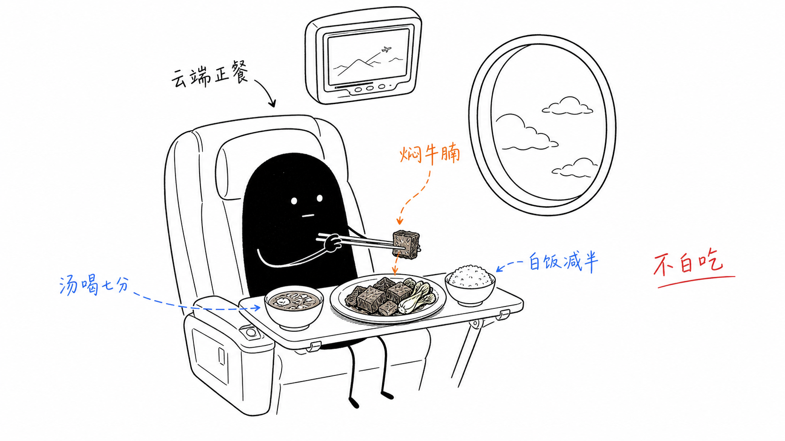

# 云端焖牛腩：三万英尺上的一顿「不白吃」

悉尼飞香港，国泰 CX162，商务舱。屏幕上正好跳出一句字幕——

> **Got all your favorites.**

低头一看小桌板，还真是。一盘**粤式焖牛腩配时蔬**、一小碗白饭、一盅**炖汤**。这道焖牛腩是国泰粤菜里最拿手的看家菜之一：牛腩焖到软糯脱骨，酱汁琥珀色，芥蓝翠得发亮。不是花哨的西式摆盘，是那种一口下去就知道「对了」的家常讲究。

## 为什么这盘点得聪明

九个小时的航程，一顿正餐，怎么吃才不亏待身体、又不亏待嘴？这盘刚好踩在点上：

- **牛腩** —— 优质蛋白，份量克制，就那么几块，够味不过量。
- **芥蓝时蔬** —— 一整把绿叶给足纤维，油腻里的一口清爽。
- **炖汤** —— 暖胃、补水。机舱干得厉害，这盅汤比什么都熨帖。

粤菜的智慧全在这盘里：**焖**是时间换来的软糯，**蒸炖**是不夺食材本味的分寸。它不喧哗，却每一步都有道理——就像陈梦因在《食经》里写的，好菜讲的从来不是「怎么做」，是「为什么这么做」。

## 吃得再聪明一点的三个小动作

| 动作 | 为什么 |
|------|--------|
| **白饭吃一半** | 蛋白和菜已经够，碳水减半更清爽 |
| **别拿芡汁泡饭** | 那层酱偏咸偏油，肉裹的味道足够了 |
| **汤喝七八分** | 炖汤盐分不低，暖身即可，别见底 |

配餐那杯白葡萄酒，白天航班浅酌半杯佐个兴就收，剩下的交给水——对身体好，对落地后的胃口也好。

## 一句话带走

三万英尺之上，屏幕替你说了那句 **Got all your favorites**；而真正的讲究是：**就算在云端，也别白吃。** 一盘焖牛腩，焖进去的是时间，夹起来的是态度。

*落地前那顿，记得留胃口给一碗云吞面或皮蛋瘦肉粥——暖胃、好消化，晚上到中环还能从容再吃一顿。*

---

SYD → HKG · 国泰 CX162 · 商务舱 · 2026-07-11 · 一顿路上的正餐笔记
