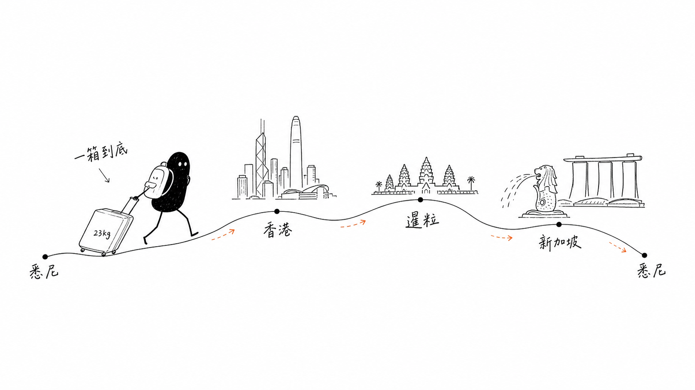

# 🧳 旅途全程手册 · 香港 × 暹粒 × 新加坡

> 悉尼往返 · 2026-07-12 → 07-26 · 15 天 · 一人出差 + 顺道玩
> 4 段航班 / 3 座城 / 3 家酒店 · 一个背包 + 一个 23kg 托运箱，一箱到底

**路线一览**

---

## Basics

| | |
|---|---|
| **日期** | 2026-07-12（周日）出发 → 07-26（周日）清晨到家 |
| **路线** | 悉尼 → 香港 → 暹粒 → 新加坡 → 悉尼 |
| **出差城市** | 香港（7/13–7/16）、新加坡（7/20–7/24） |
| **纯玩** | 暹粒 2 晚（7/17–7/19），吴哥一日游 7/18 |
| **行李** | 1 背包（7kg 手提，暹粒白天背它）+ 1 托运箱（23kg，全段统一） |
| **订座参考** | FO5IQT（去程国泰 + 返程英航同一 PNR） |

---

## Preferences & 约束

- **轻装自拖**：只带一个背包 + 一个 23kg 箱，要轻便好拖（目标 15–18kg）。
- **不带笔记本**，带 iPad mini。
- **面料**：衬衫/裤子多为速干化纤，全程手洗。
- **天气**：三地 7 月湿热 80%+；悉尼 7 月冷；暹粒雨季午后暴雨；香港室内空调猛需洋葱式叠穿。
- **吴哥着装**：有袖上衣 + 过膝长裤（鞋全程不用脱）。
- **膝盖**：左膝髌骨轻伤，忌屈膝负重下行 → 下陡梯侧身抓扶手，暹粒借竹杖；护膝用「带子款」髌骨绑带。
- **支付**：全程优先 Wise 卡（USD/SGD 直扣，零汇损），不喜欢 PayPal。
- **看展偏好**：想看艺术展；白天上班 → 只能晚上 + 周末。

---

## Itinerary（时间线）

| 日期 | 行程 |
|---|---|
| **7/12 周日** | 悉尼 SYD 10:10 → 香港 HKG 17:45　**国泰 CX162**（商务舱 Business Light，座 19A，777-300ER，9h35m，蚝油炒牛柳餐已选） |
| **7/13–7/16** | 香港办公（QRT 中环 Central Tower）；下班后逛中环画廊群 / 太平山顶 / 天星小轮 |
| **7/17 周五** | 香港 HKG 13:20 → 暹粒 SAI 18:55　**曼谷航空 PG**（Booking.com 订，机场柜台办，提早 3h，带 e-Visa 打印） |
| **7/18 周六** | 暹粒吴哥一日游（见下）+ 晚上 Phare 马戏 |
| **7/19 周日** | 暹粒 SAI 16:00 → 新加坡 SIN 19:25　**新航 SQ165**（自动值机） |
| **7/20–7/24** | 新加坡办公（QRT IOI Central Boulevard）；工作日晚 teamLab / 滨海湾灯光秀 / 老巴刹 |
| **7/25 周六** | 新加坡 SIN 20:20 → 悉尼 SYD 06:05(+1)　**英航 BA0015** 夜航 |
| **7/26 周日** | 清晨抵悉尼到家；入境如实申报食品 |

### 🌅 7/18 吴哥一日游动线

| 时间 | 安排 |
|---|---|
| 04:30–05:30 | 小吴哥 Angkor Wat 看日出 |
| 08:30–10:30 | 大吴哥 Angkor Thom + 巴戎寺 Bayon（高棉的微笑） |
| 10:30–12:00 | 塔布茏寺 Ta Prohm（古墓丽影树根盘墙） |
| 12:00–14:00 | 回城午餐 + 避暑午休（正午最晒） |
| 15:00–17:30 | 巴肯山日落 / 或女王宫 Banteay Srei |
| **20:00** | **Phare 柬埔寨马戏**（1h，B 区 $28，官网提前订） |

- 突突车一日包车约 USD 20–25；带水 / 防晒 / 驱蚊；着装过膝长裤 + 有袖上衣。

---

## Bookings & 状态

**✈️ 机票（4 段一箱 23kg 到底）**
- 去程 **CX162** — 商务舱，座 19A，餐食已选，国泰 App 可进 Manage Booking ✅
- 港→暹 **曼谷航空 PG** — Booking.com，机场柜台办 ✅
- 暹→新 **SQ165** — 新航，自动值机，App 已加 ✅
- 返程 **BA0015** — 英航，起飞前 24h 值机，App 已加 ✅
- 常客号：QF 澳航（去程已挂）

**🏨 酒店（3 家）**
- 香港 **The Murray, a Niccolo**（公司订）· Cotton Tree Drive, Central · 7/12–7/17
- 暹粒 **HARI Residence & Spa**（Agoda）· 7/17–7/19
- 新加坡 **The Fullerton Hotel**（公司订）· Fullerton Square · 7/19–7/25

**🛂 签证**
- 柬埔寨 e-Visa — **已出签** ✅（打印件 ×2 随身，落地前填 e-Arrival）

**💳 支付 & 通讯**
- 主力 Wise 卡（USD/SGD）+ 备用卡 + 小额 USD 现金；Grab 已绑 Wise
- 上网 Airalo eSIM（Asialink 10GB）**已买+已下载装机**，仅待落地香港激活；澳洲号搬备用机留家，短信前转已实测可收（含银行 OTP）

---

## Still to decide / 行前待办

- [x] ~~买 Airalo eSIM~~ ✅ 已买+已下载，仅待落地激活
- [ ] 7/10 中午 10:10 国泰 CX162 网上值机（App 内 Check-in 存 Wallet）
- [ ] 7/10 起 填柬埔寨 e-Arrival 电子入境卡
- [ ] 行前几天 订吴哥 1 日票 $37 + Phare 马戏 B 区 $28
- [ ] 行前 备好兜底卡（Wise 主力 + Amex/Visa 备用）；扫 amaysim 余额盖过 7/26　*（境外交易无需申请，卡默认可用）*
- [ ] 7/16 周四 填新加坡入境卡 SGAC
- [ ] 香港头两天 采购：AirTag 4 件装 + 髌骨绑带 + 驱蚊液 + Lightning 线 ×2
- [ ] 7/26 落地悉尼 Incoming Passenger Card 申报食品

### ⚠️ 入境澳洲红线
🚫 新加坡猪肉脯（bak kwa）禁带回澳洲——当地吃别带。✅ 饼干/茶/糖果可带但须如实申报。酱料（Kaya/辣椒蟹）超 100ml 记得**托运别随身**。

---

## 玩乐 · 购物 · 吃

- **看展/玩**：香港下班后中环画廊群、太平山顶、天星小轮；新加坡 teamLab（Klook 前一天买票）、滨海湾灯光秀 19:45/20:45（免费）、鱼尾狮金沙水秀。
- **想买**：米菲周边（星巴克小号挂件 @ One Fullerton、新航 KrisShop 挂件 S$35、Batik 系列）——全现金 Wise 卡买。
- **吃**：暹粒 Amok 咖喱鱼 / Kroya / Pub Street；香港镛记烧鹅 / 添好运；新加坡老巴刹海南鸡饭 / 辣椒蟹。
- **手信**：给港同事 Tim Tam / 夏威夷果；给家人 菠萝挞 / TWG 茶 / Kaya 酱（合法可带）。

---

*行程要点提炼自长期维护的《旅途主清单》，更新于 2026-07-07；一切以主清单实时状态为准。为公开分享已隐去证件号、支付账户等敏感信息。*
