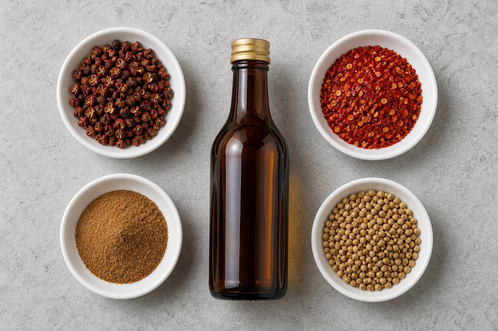

# 悉尼买齐川味牛肉干佐料

给一公斤 topside 牛肉干准备的一趟采购。所有东西在唐人街一站买全，不用跑第二个地方。

*左上：花椒（整粒）。右上：辣椒面。左下：五香粉。中间：绍兴酒。右下：芫荽籽（做 biltong 才用）。*

---

## 先去哪

**Thai Kee IGA** — Level 1, 9–13 Hay St, Haymarket（Market City 楼上）
悉尼最大的亚洲超市，一万多种货。花椒、辣椒面、五香粉、生抽老抽、绍兴酒，全在同一个货架区，五分钟拿完。每天 9:30–22:00。
电话 (02) 9211 3150
📍 https://www.google.com/maps/search/?api=1&query=Thai+Kee+IGA+9-13+Hay+St+Haymarket+NSW+2000

**Tong Li / Miracle 一带** — Sussex St 与 Hay St 交界那几家小超市
比 Thai Kee 小，但川货更专。要找带牌子的二荆条辣椒面、汉源花椒，这几家碰上的机会更大。逛完 Thai Kee 顺路过去，走三分钟。
📍 https://www.google.com/maps/search/?api=1&query=Asian+grocery+Sussex+St+Haymarket+Sydney

---

## 逐样说

### 花椒 · Sichuan peppercorn · 花椒

**买整粒的，不要买粉。** 花椒的香气全在挥发油里，磨成粉三个月就散光了，剩下的只有苦。整粒买回来，用干锅小火焙到出香，晾凉了自己碾——差别不是一点半点。

袋子上找 **"汉源"** 或 **"大红袍"**。要**红花椒**，不是青花椒——青花椒麻得冲，香气偏柠檬味，适合做水煮鱼，不适合牛肉干。

好的花椒是暗红带褐、开口的，抓一把闻着冲鼻子。发黑、闭口、闻着只有木头味的是陈货。

一包 100g 几块钱，够你做十次。

### 辣椒面 · Chilli flakes · 辣椒面

这是最要挑的一样，因为**辣和香是两回事**。

- **二荆条**（Erjingtiao）——四川的当家品种，辣度中等，但香气足、颜色红亮。做牛肉干要的就是这个：越嚼越香，不是一味地烧嘴。
- **朝天椒**（Chaotianjiao / Facing Heaven）——辣度高，香气弱。想上强度就掺一点，别单用。
- **韩国辣椒粉**（gochugaru）——偏甜偏柔，颜色漂亮，但做川味撑不起来。买不到二荆条时的备选。

袋子上通常直接印中文品名。买**粗粉**不要细粉，细粉容易糊。

### 五香粉 · Five spice powder · 五香粉

这一样反而不用讲究，随便哪个牌子都行，差别不大。八角、桂皮、丁香、花椒、茴香磨在一起，用量小，一小罐能用一年。

### 生抽 + 老抽 · Light + dark soy sauce

海天、李锦记都行。**生抽出咸鲜，老抽只上色**——老抽用量很小，一公斤肉一汤匙就够，多了发苦发黑。

### 绍兴酒 · Shaoxing wine · 绍兴酒

找瓶身写 **"花雕"** 或 **"绍兴加饭酒"** 的，几块钱一瓶，不用买贵的。

注意避开写着 **"cooking wine"** 且配料表有盐的那种——那是为了避酒类税加的盐，能用，但你得把腌料里的酱油量往下调。

### 芫荽籽 · Coriander seeds · 芫荽籽

**只有做 biltong 才用**，川味用不上。

这个不用去亚洲超市，Coles / Woolworths 的香料架就有，写作 coriander seeds。唐人街的印度杂货店量大便宜得多。

同样：**买整粒**，干锅焙香再碾。芫荽籽焙过之后有一股柑橘皮的香味，那是 biltong 的灵魂，粉状的完全出不来。

---

## 一公斤肉的腌料配方（川味五香辣）

- 生抽 60ml
- 老抽 15ml（只为上色）
- 绍兴酒 30ml
- 二荆条辣椒面 2 汤匙
- 花椒粉 1 茶匙（自己焙自己碾的）
- 五香粉 1 茶匙
- 白胡椒 1 茶匙
- 蒜末 4 瓣、姜末一小块
- 糖 1 茶匙（只为平衡，可省）

拌匀，冷藏腌 12–24 小时。

烘的时候：铺烤架、下垫烤盘，**120°C 先烤 15 分钟杀菌**（USDA 建议干燥前肉心要到 71°C），再降到 **70°C 风扇档，烤箱门夹木勺留缝排湿**，continue 3–5 小时，每小时翻面。最后二十分钟撒白芝麻和额外辣椒面。

判断标准不是时间是状态：**弯折时表面出现白色纤维裂纹但不断，就好了。**

**容易翻车的地方**：肉片切太厚（要 4–5mm）；烤箱门关死，水汽出不去，成品发韧发暗；温度调过 80°C，肉出油变柴。

---

## 采购清单

- [ ] Topside 牛肉 1kg（肉铺，要求 trim fat、4–5mm、against the grain）
- [ ] 花椒（整粒，红花椒）
- [ ] 二荆条辣椒面（粗）
- [ ] 五香粉
- [ ] 生抽、老抽
- [ ] 绍兴花雕
- [ ] 白芝麻
- [ ] 芫荽籽（只在做 biltong 时）
