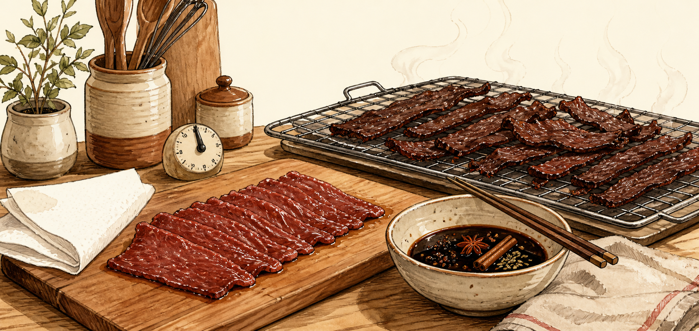

# 中式五香牛肉干 · 家庭高蛋白版

> 市售牛肉干每 100g 常有 20g 以上的糖、1500mg 以上的钠。自己做,能把糖和钠砍掉一大半,留下最干净的那 50g 蛋白质。



---

## 为什么值得自己做

牛肉干的祖宗是**行军粮**。蒙古骑兵把肉风干砸碎装进皮囊,一路吃到欧洲;南非的 **Biltong**、南美的 **Charqui**(英文 jerky 一词的词源)都是同一套生存智慧——**用脱水把蛋白封存起来**,让肉在没有冰箱的年代活下去。

而中式五香牛肉干在这套古法上,叠了一层**香料的层次**:八角、桂皮、花椒、小茴香、丁香。它不只是"保存",更是把肉做成了一件有香气结构的东西。

你在厨房里复刻的,是人类最古老的蛋白保存术之一。

---

## 一、选肉:成败一半在这

**认准精瘦、少筋膜的部位。** 脂肪不会脱水,会让成品发腻,还容易哈喇变质。

| 部位 | 评价 |
|---|---|
| **牛后腿肉 Topside / Round** | ⭐ 首选。澳洲超市极常见、便宜、瘦、纤维长 |
| 牛霖 Knuckle / 里脊 Eye of Round | 次选,同样合格 |
| 雪花牛、肋眼 | ❌ 油花越漂亮越不适合 |

**用量参考:** 生肉 500g → 成品约 180–200g。脱水会掉掉一大半重量,这是正常的。

### 切法决定口感

- **顺纹切** → 有嚼劲,经典牛肉干的筋道感
- **逆纹切** → 好咬易断,牙口友好
- **厚度 3–5mm** —— 太厚烘不透,太薄一碰就碎
- 💡 **关键技巧:** 切之前把肉**冷冻 1 小时**至半硬化,切出来又薄又齐

---

## 二、五香腌料(控糖控钠版)

以 **500g 精瘦牛肉**计:

### 香料底(先干焙)
```
八角        2 颗
桂皮        1 小段
花椒        1 茶匙
小茴香      1 茶匙
丁香        2 粒(别多,会抢味)
```
> **别省这一步:** 香料下锅**小火干焙 1–2 分钟**至出香,再磨粉或直接用。干焙是五香味立体不立体的分水岭。

### 液体与调味
```
减盐生抽    30ml       ← 用减盐版,别再另外加盐
老抽        5ml        ← 只为上色
姜片        3 片
蒜          2 瓣(拍碎)
绍兴酒      15ml       ← 去腥增香
赤藓糖醇    1 茶匙     ← 或干脆不放糖
白胡椒      少许
辣椒粉      按口味     ← 想要辣味版就多加
```

### 腌制
1. 肉片与所有腌料拌匀,**冷藏 4 小时至过夜**,中途翻一次
2. ⚠️ **腌完务必用厨房纸把表面水分吸干** —— 这步别偷懒,湿着烘会发黏、颜色也不漂亮

---

## 三、三种烘法,选你家有的

### ① 烤箱 —— 最普及
- **温度 70–80°C**
- **烤箱门夹一根木勺留缝排湿** ← 关键,不排湿就是在蒸肉
- 肉片摊在烤架上**不重叠**,下面接烤盘
- **3–5 小时**,中途翻面一次

### ② 风干机 Dehydrator —— 最省心
- **70°C,4–6 小时**
- 澳洲这类机器很常见,如果你会常做,值得入一台

### ③ 空气炸锅 —— 最快,适合小量
- **80°C,2–3 小时**,中途翻面
- ⚠️ 空间小、风大,容易过头变柴,勤看

### 怎么判断好了
> **弯折会裂、但不会断。** 这是标准状态。
> 掰下去脆断 = 烘过了;掰下去软趴不裂 = 还欠火。

---

## 四、一条食品安全硬规矩

**低温风干杀不透菌。** 70–80°C 的慢烘是脱水,不是杀菌。

✅ **正确做法:** 在低温慢烘之前(或之后),让肉**在 70°C 以上维持几分钟**。最简单的操作是:

> 腌好的肉片先入 **120°C 烤 10 分钟**,再转 70–80°C 慢烘到干。

这一步保证安全,又不影响口感。别跳。

---

## 五、保存

- 🔑 **必须完全干透再装** —— 有一点回软就是霉变的起点
- **密封冷藏:1–2 周**
- **真空 + 冷冻:数月**
- 装罐前放凉到室温,热气封进去会返潮

---

## 六、营养账

| 项目 | 自制五香牛肉干(每 100g 成品) |
|---|---|
| **蛋白质** | **≈ 50g** 💪 |
| 碳水 | 几乎为零 |
| 糖 | 用赤藓糖醇 → 接近 0 |
| 钠 | ⚠️ 全看你的生抽用量 |

**撸铁后的补给包里揣一袋,比蛋白棒干净得多。**

### 唯一要盯紧的:钠

- 用**减盐生抽**,并且**不要再另外加盐**
- 香料本身就在提供风味,不需要靠盐撑
- ✅ **验收标准:做完尝一片,觉得"好像淡了一点点"才是对的** —— 干货的咸味会在嘴里累积,刚出炉觉得刚好,吃到第五片就偏咸了

---

## 变体:南非 Biltong 风格

想换个完全不同的路子,把腌料换成:

```
苹果醋 / 红酒醋   50ml   ← 主角,酸味定调
芫荽籽(干焙磨碎)  2 茶匙  ← Biltong 的灵魂香气
粗黑胡椒          1 茶匙
海盐              少量
```

- 肉**切得更厚(1cm 以上)**,顺纹
- **不加热,纯风干**:阴凉通风处挂 3–5 天
- 口感更松散、有奶酪般的醇香,酸味打底,风味和五香完全是两个世界

---

## 速查清单

```
□ 牛后腿肉 · 冷冻 1 小时 · 切 3–5mm
□ 香料干焙出香
□ 减盐生抽腌 4 小时~过夜
□ 厨房纸吸干表面水分  ← 别偷懒
□ 120°C 烤 10 分钟(安全)
□ 转 70–80°C · 留缝排湿 · 3–5 小时
□ 弯折会裂不断 = 好了
□ 完全放凉干透 → 密封冷藏
```

---

*一片牛肉干,是把一块肉的时间抽掉水分保存下来。慢工出的东西,吃起来才知道值。*
